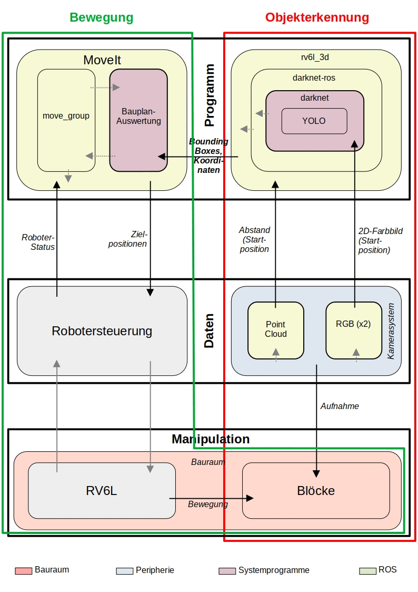
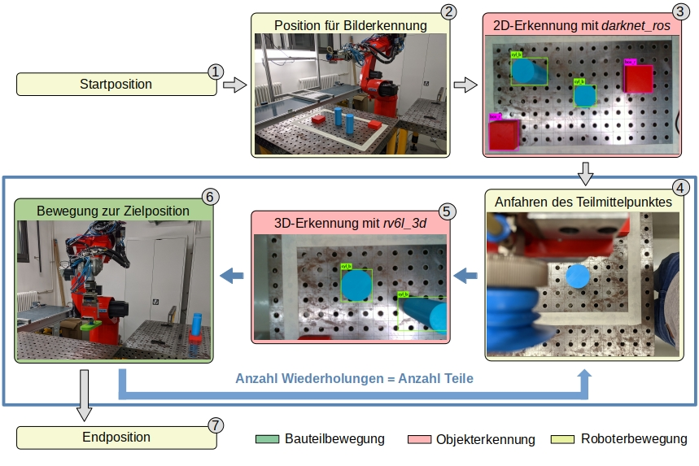
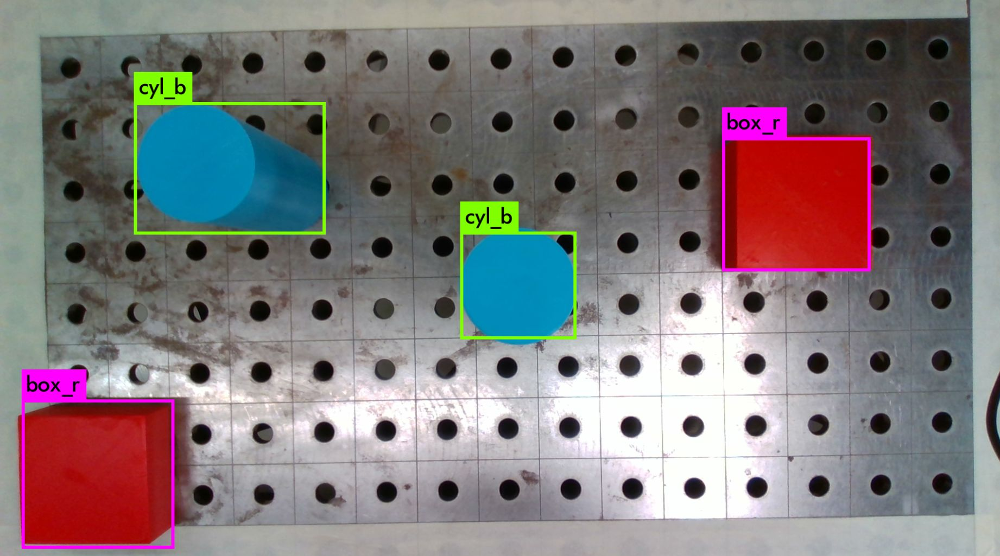

# Object detection and Point Cloud mapping using ROS Noetic and Intel RealSense 435

This project aims to provide packages for recognizing different objects and their position using a Intel RealSense 435.
The goal is using the real-time neural network for object detection YOLOv3 to recognize different objects using the RGB camera of the RealSense and get their position from the 3D sensor.

***Changing parameters and config files is only required if the packages from the original source are used. Packages in this repo are already adjusted.***

## Table of contents

- [Object detection and Point Cloud mapping using ROS Noetic and Intel RealSense 435](#object-detection-and-point-cloud-mapping-using-ros-noetic-and-intel-realsense-435)
  - [Table of contents](#table-of-contents)
  - [General information](#general-information)
  - [Project videos](#project-videos)
  - [Package structure \[de\]](#package-structure-de)
  - [Movement \[de\]](#movement-de)
  - [Detection example](#detection-example)
  - [Quick start](#quick-start)
  - [Requirements](#requirements)
  - [Hints for compilation of required dependencies and ROS packages](#hints-for-compilation-of-required-dependencies-and-ros-packages)
    - [Building darknet\_ros](#building-darknet_ros)
      - [Use Nvidia CUDA](#use-nvidia-cuda)
  - [Hand-eye calibration](#hand-eye-calibration)
  - [Adding Objects](#adding-objects)
    - [Adding custom objects to the dataset](#adding-custom-objects-to-the-dataset)
    - [Training with own objects](#training-with-own-objects)
  - [Outlook](#outlook)
  - [Authors](#authors)
    - [Instructions](#instructions)
    - [Code](#code)
    - [External resources](#external-resources)

## General information

This page includes information for building this project. In-depth instructions can be found under [detailed_instructions](detailed_instructions).

Commands using the "`#`"-prefix have to be executed with elevated privileges (either using sudo/doas or executing as a root user)  
Commands using the "`$`"-prefix can be executed as a normal user

## Project videos 

Detection: https://youtu.be/-ahuV4eyKP4  
Movement:  https://youtu.be/ZAKhv4KN0LU

## Package structure [de]

## Movement [de]

## Detection example

## Quick start

* Install ROS Noetic
* Clone this repository
* Enter the ros_workspace directory in your terminal emulator
* Dependencies: `$ rosdep install --from-paths .`
* Build: `$ catkin build`
* Source: `$ source devel/setup.<shell>`
* Launch: `$ roslaunch rv6l_main first.launch`, wait for interface connection, `$ roslaunch rv6l_main second.launch`, `$ rosrun rv6l_pick_and_place pick_and_place_detection_test.py`
* For optimal performance, install NVIDIA CUDA: [instructions](detailed_instructions/setup.md#with-cuda) Note: repeat `$ catkin build` after

## Requirements

**This is only required if downloaded from the original sources.**

The following setup is required for the project to work:
* [Ubuntu 20.04 LTS](https://ubuntu.com/download/desktop) as the base OS
* [ROS Noetic ](https://wiki.ros.org/noetic/Installation/Ubuntu) (follow instructions for ros-noetic-desktop-full)
* [Darknet ROS](https://github.com/leggedrobotics/darknet_ros) package for using YOLO in conjunction with ROS
* [Darknet ROS 3D](https://github.com/IntelligentRoboticsLabs/gb_visual_detection_3d) [Noetic branch!] to get 3D-position of objects recognized by Darknet ROS
* [Darknet ROS 3D message files](https://github.com/IntelligentRoboticsLabs/gb_visual_detection_3d_msgs) [Kinetic branch!] necessary message (.msg) files for Darknet ROS 3D
* [OpenCV 4](https://github.com/opencv/opencv) (can be installed through the official Ubuntu repositories using `# apt install opencv`)
* [RealSense ROS wrapper](https://github.com/IntelRealSense/realsense-ros) (there's also a version in the ROS Noetic repository, but the GitHub code is more up to date and tested with this project)
* A compatible USB 3.1 controller

## Hints for compilation of required dependencies and ROS packages

**This is only required if downloaded from the original sources.**

### Building darknet_ros

**This is only required if downloaded from the original sources.**

darknet_ros needs additional dependencies that can be installed using `$ rosdep install -r --from-paths [workspace path]`. "Weights" are required for object detection.  
Additionally, a config file has to be adjusted. Detailed instructions can be found in the [detailed_instructions/setup.md](detailed_instructions/setup.md#installing-darknet_ros) file.

#### Use Nvidia CUDA

To enable Nvidia CUDA Support in darknet_ros, the CUDA Toolkit and NVCC hast to be installed. Instructions can be found [here](https://developer.nvidia.com/cuda-downloads?target_os=Linux&target_arch=x86_64&Distribution=Ubuntu&target_version=20.04&target_type=deb_local). The local deb (or network deb) is the installation method used here. Also, g++ and gcc are only supported on versions lower than 8. Detailed instructions to make CUDA work on the setup used here can be found in [detailed_instructions/setup.md](detailed_instructions/setup.md#installing-darknet_ros).

## Hand-eye calibration

**Not implemented yet. The Robot uses a manual static transformation**

To transform the coordinates between camera- and robot-coordinates, a hand-eye-calibration is necessary. The [MoveIt](https://moveit.ros.org/) package can be used along with the [MoveIt Calibration](https://github.com/ros-planning/moveit_calibration) tools to do the calibration.  
Calibrations can be performed "eye to hand" (camera mounted at the base frame / not moving with the robot) and "eye in hand" (camera mounted on the end effector). For this configuration, the "eye to hand" method has to be used as the kinect doesn't move with the robot.  
A visual calibration target mounted to the end effector is used for the calibration. The entire calibration process is described in [detailed_instructions/calibration.md](detailed_instructions/calibration.md#hand-eye-calibration)

## Adding Objects

### Adding custom objects to the dataset

Custom objects can be added to the configuration using a custom `weights` file. Weights for general objects using YOLOv3 can be found [here](https://pjreddie.com/media/files/yolov3.weights) for example. Weights are placed in [this](../code/ros_workspace/src/object_detection/darknet_ros/darknet_ros/yolo_network_config/weights) directory.
### Training with own objects

To generate weights for adding own objects, multiple different images of those objects are necessary. The images should differ in image size, position and orientation of the object, surroundings and lightning for good results. A minimum of 100 images per object is recommended for good accuracy. Bounding Boxes have to be added around objects in the images. That can be done using a tool like [LabelImg](https://github.com/tzutalin/labelImg). The entire training process is described in [detailed_instructions/training.md](detailed_instructions/training.md).

## Outlook

* Object orientation recognition
* Dynamic object count 
* Error handling
* Integration of subscriber in movement package
* Better scan algorithm
* Dynamic block height and movement algorithm

## Authors
### Instructions
* David Gries

### Code
* David Gries
* Dennis Steinbeck
* Marvin Leber

### External resources
* [YOLO](https://pjreddie.com/darknet/yolo/)
* [Darknet](https://github.com/AlexeyAB/darknet)
* [Darknet ROS](https://github.com/leggedrobotics/darknet_ros)
* [RealSense SDK](https://github.com/IntelRealSense/librealsense)
* [RealSense ROS](https://github.com/IntelRealSense/realsense-ros)
* [Darknet train helper script](https://github.com/theAIGuysCode/YoloGenerateTrainingFile/blob/2bcb9b1ba7e75061ce1c267a48860c67cb229b62/generate_train.py)
* [libfreenect2](https://github.com/search?utf8=%E2%9C%93&q=libfreenect2)
* [IAI Kinect (OpenCV4 fork)](https://github.com/Yanxxx/iai_kinect2)
